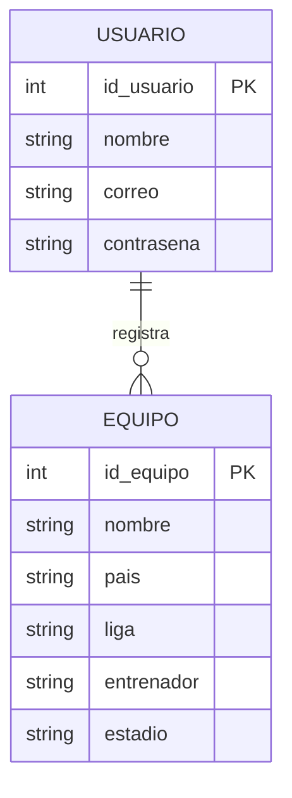

```mermaid
erDiagram

    USUARIO {
        int id_usuario PK
        string nombre
        string correo
        string contrasena
    }

    EQUIPO {
        int id_equipo PK
        string nombre
        string pais
        string liga
        string entrenador
        string estadio
    }

    USUARIO ||--o{ EQUIPO : registra
```
